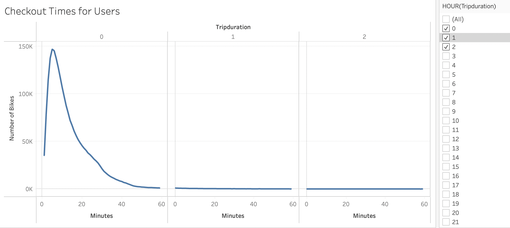
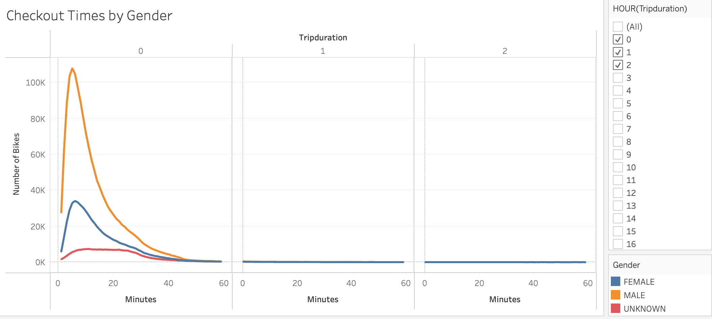
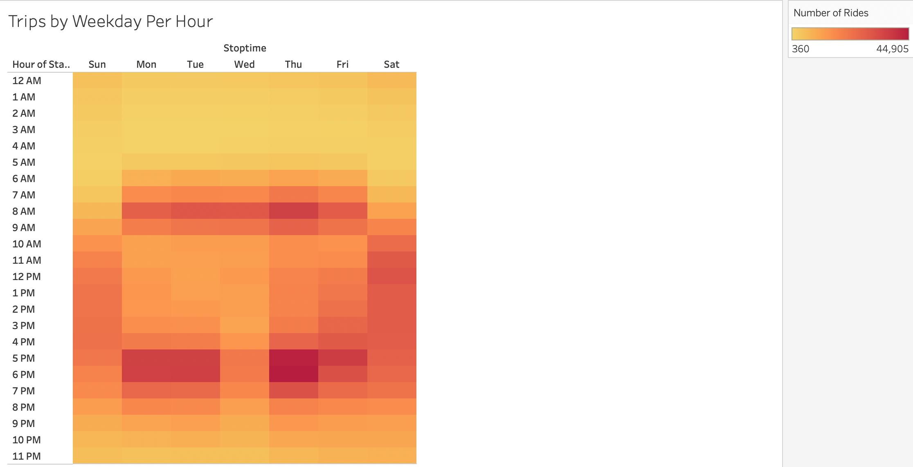
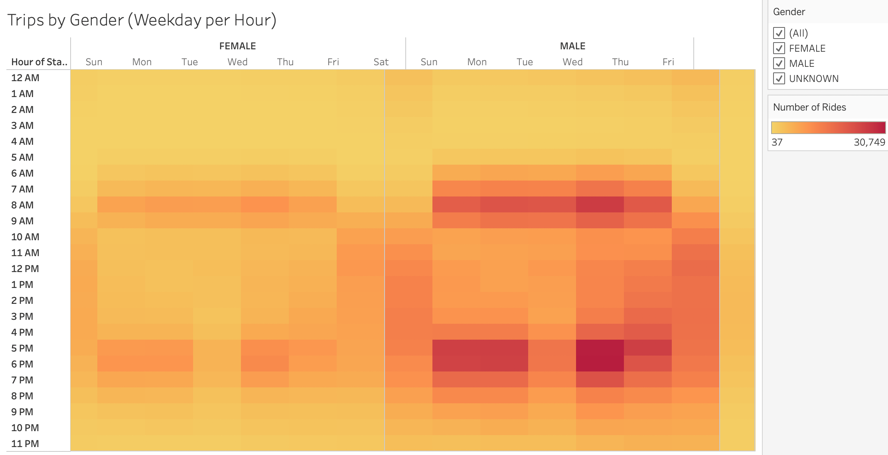
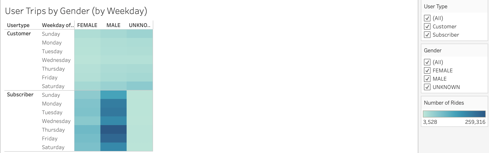
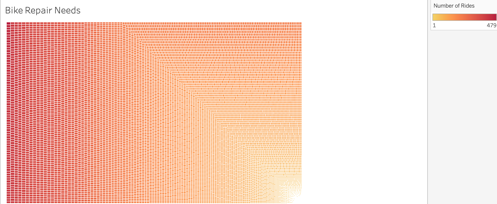
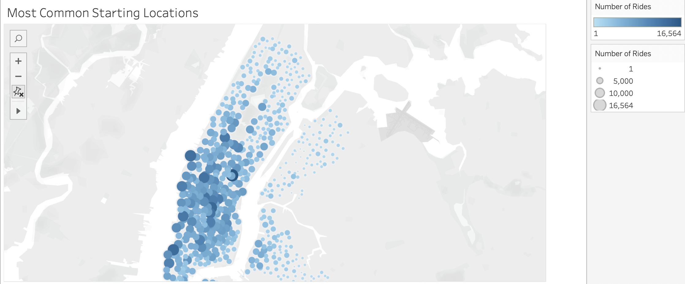

# Ride Share Project Proposal 

## Analysis Overview
The purpose of this project is to analyze a dataset of Citi Bike rides in NYC to understand how the ride sharing company functions effectively in NYC. With that knowledge, the goal is to then propose a ride share project in Des Moines, Iowa, utilizing a data-drive approach to building the proposal based on the Citi Bike analysis. The analysis covered questions like how many rides were logged overall, what types of customers were riding (long- or short-term customers, and customer gender), how long are people riding, on what days, and from what locations?

<b>The full analysis can be accessed on Tableau Public at this link:</b>
[Tableau Dashboard](https://public.tableau.com/shared/486RXBT96?:display_count=n&:origin=viz_share_link "Tableau Dashboard")

## Results 

### Bike User Checkout Times

This visualization filters the number of overall rides in the data set but the length of trip duration. The analysis shows that most rides were completed within 1 hour, with the majority lasting 20 minutes or less.

### Bike User Checkout Times by Gender

This visualization adds a gender filter to the checkout time visualization. The analysis shows that a majority of rides are taken by men. While most rides lasted 20 minutes or less, male riders had more trips lasting longer than 30 minutes compared to women and the unknown group. The unknown group had about as many rides that lasted 30 minutes as 20 minutes.

### Trips by Weekday per Hour

This heatmap shows that the majority of rides taken Monday through Friday occured during commuting hours between 7-9 AM and 5-7 PM. On weekends, the number of rides was more consistent throughout the day.

### Trips by Gender (Weekday per Hour)

This heatmap compares weekday usage per hour by gender. Both men and women used the bikes more often during commuting hours. The unknown group had less of a preference for commuting hours; in general, there was no spike in usage for this group at any particular part of the day.

### User Trips by Gender

This heatmap shows that yearly subscribers, both male and female, use the bikes more often than short-term customers. The opposite is true for the unknown group; in this case, more short-term customers use the bikes. This could be because short-term users are less likely to build a profile that includes personal information like gender.

### Planning for Bike Repair

This graph helps to determine which bikes may need repair most urgently based on the number of times that bike has been used. By hovering over the graph, you can see which bike_ids are associated with the most rides. There are some bikes with less than 3 rides and some with close to 500 rides. In addition to anticipating repair neeeds, this visual can also be used to determine which bikes may need to be rotated out of high traffic areas and which can be rotated in to also extend the longevity of the bikes.

### Top Locations to Start a Ride

This map visusalization shows where rides are most commonly initiated. The top areas are focused around midtown and lower Manhattan. An initial thought is that these locations may be associated with more tourists. However, knowing that the most common times for rides are around commuting hours, these popular spots could be associated with high concentrations of office buildings. Additionally, some of the popular areas are near central park and near the water on the west side of Manhattan. Bike users may be more likely to commute from these areas using a bike because 1) there are fewer subway stations in these areas and 2) these areas are associated with more park areas with safer, more designated bike lanes; essentially, areas that are more bike friendly.

## Analysis Summary

### Overview of Findings
In order to prepare for starting a bike sharing business in Des Moines, Iowa, the company's founders should consider placing bikes not only in popular tourist destinations but also in areas that are popular office locations and areas that are far from other public transportion and/or have designated bike paths.

Additionally, the company should focus on promoting yearly subscriptions as customers with subscriptions tend to ride more. 

To keep the bikes in prime shape, the company should utilize visualizations which show the bikes that have been used the most and for the longest amount if time. This can help prioritize repairs and consider which bikes may need to be rotated out of high-traffic areas. The data shows that repairs should be done early in the morning to avoid conflicts with commuters during the most popular times for riding.

Finally, the ride-sharing data shows that men are more likely to consider biking as a mode of transportation. This knowledge can help with marketing efforts. 

### Additional Analysis to Consider 
The company should also consider looking into and creating visualizations for the most popular day for riding overall as well as the most popular months for riding. This will also help to focus repair efforts and to consider when to potentially add more bikes into rotation.

A map showing the most popular routes (start and end locations) would also add more depth to the analysis on where people are riding to and from. If there are popular routes that connect with common tourist destinations, for instance, the company can consider focusing marketing efforts on easy ways to get from one popular sightseeing location to another.
